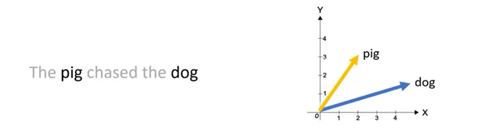
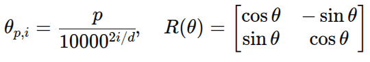

## Rotary Positional Embeddings

## Overview
Rotary positional embedding represents a new approach in encoding positional information.
Traditional methods like absolute or relative, come with their limitations.
Absolute assign a unique vector to each position, which doesn't scale well and fails to capture relative positions effectively.
Relative embeddings, focus on the distance between tokens, enhancing the model's understanding of token relationships but complcating the model architecture.
Rotary Positional Embeddings (RoPe) combines the strengths of both, that is, it encodes positional information in a way that allows the model to understand both the absolute postion of tokens and their relative distances.
This is achieved through a rotation in the embedding space.

# How RoPe works

RoPe introduces a concept, whereby, instead of adding a positional vector, it applies a rotation to the word vector.
Take for example: a two-dimensional word vector for the token "dog" in the above diagram.
To encode its position in a sentence, RoPe rotates this vector.
The angle of rotation (theta) is proportional to the word's postion in the sentence.
For instance, the vector is rotated by theta for the first position, 2theta for the second and so on till the last token.

## Benefits of RoPE.
1. Relative Postional Awareness : unlike absolute postional embeddings, RoPe naturally encodes relative postions between tokens. This is crucial as it makes it easier for models like transfromers to generalize across different sequence lengths.
2. Better generalization: because relative distance between tokens is preserved, RoPe improves generalization to unseen text lengths and domains, comapred to absolute encodings.
3. Efficiency : RoPe doesn't require large embedding tables (like learned absolute embeddings). Instead,it uses simple sinusoidal functions and rotations, which computationally light.
4. Stability of vectors: Adding tokens at the end of a sentence doesn't affesct the vectors for words at the beginning, facilitatig effecient caching.

## Formulaes we use in RoPe

Taking the sentence : "The pig chased the dog"

| Token  | Position \$p\$ |
| ------ | -------------- |
| The    | 0              |
| pig    | 1              |
| chased | 2              |
| the    | 3              |
| dog    | 4              |

   

