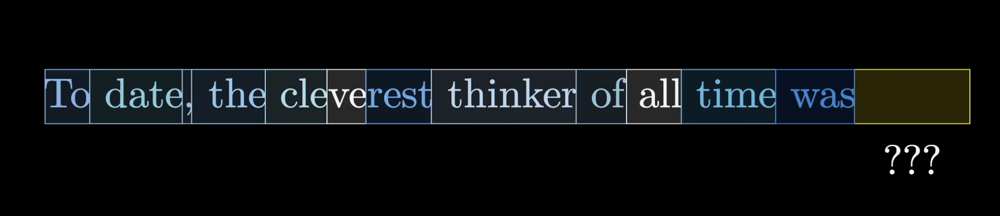

# Embeddings
## Prerequisites
 - It is recommended that you have gone through the `tokenizer.md` file

## Overview
- So far, we’ve covered the process of tokenization — from having raw text, to defining tokenization rules, and finally assigning each character, subword, or word in a sentence an integer ID to represent it.

## Review
- In the `tokenizer.md` file,we explained what tokens are, but let’s briefly review them for example purposes.
- Tokens are small units of information, such as words, subwords, characters, images, or even segments of audio.
- Each token is then given an integer IDs,which are later embedded into vectors(list of numbers).
- These vectors:
   - encodes the meaning of that token.
   - Can be thought of as coordinates in a high-dimensional space, where tokens with similar meaning are positioned close to one another.

## Embeddings
- Words that appear in the same context often have similar meanings.
- We follow the following steps in embedding tokens:
  1. Tokenization : First, we split the input into small units called tokens. Each token is given an integer ID. These IDs are then converted into vectors in a mathematical space, where similar tokens are placed close to each other.
 2. Tokenization Rules: The model already knows rules of tokenization which it learned in the `src/tokenization.py` script.
 3. Embedding Matrix: An embedding matrix is created, where each token corresponds to a unique vector(one row in the matrix). The dimensions of the embedding space can very high, e.g 12,288. Theoritically, E(prince)- E(princess) ~= E(lion) - E(lioness).The dot product of two vectors, is measure of how well they align. In this case, this acts as a measure of similarity between words.

Below is an image of the embedding matrix. Each word corresponds to a specific vector, where each has no reference to its context. It is the role of the attention block to update a word's vector with its context (further details about attention block is present in the `attention_mechanism.md`file).

## Positional Encoders
Positional encoding provides info about the order of tokens in  a sequence, i.e where a specific word is positioned in a sentence.
A fixed positional encoding vector is added to each words's embedding.
There various type of postional encoding, for example relative,absolute and rotary positional encoding.
1. Absolute Positional Embeddings
   - Suppose we have an embedding representing a word. To encode its position, we use another of identical dimensionality, where each vector uniquely represents a postion in the sentence. For example, a specific vector is designated for the second word in a sentence.

2. Relative Positional Embeddings
   - Let's use a sentence like "I love deep learning".
   - The model learns the distance between tokens, not fixed positions.
   - For example:
      - From "I" to "love" --> distance + 1
      - From "I" to "learning" --> distance + 3
   - This helps th model focus on the relationships rather than fixed spots.
  
3. Rotary Positional Embedding(RoPE)
   - See the `RoPe.md` file where I have clearly explained rotary positional embeddings.
     

