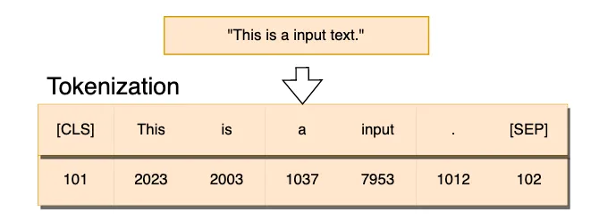
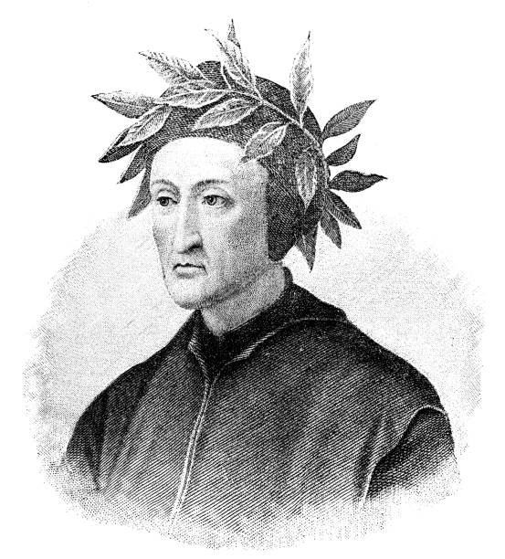

# Tokenization

## Overview
- Tokenization is the process of converting raw text into a sequence of tokens(numbers) that a Large Language Model can process.
- These tokens can represent characters,subwords, or words depending on the tokenization strategy.
 

### Input
A raw sentence, for example: 
"This is an input text."

## Output:
A sequence of integers that correspond to tokens in the tokenizer's vocabulary.
The process of tokenization is shown in the diagram below:


## Tokenizer 
Here we' ll use byte pair encoding.
The code implemetation of Byte Pair Encoding is in `src/tokenizer.py`.
### Byte Pair Encoding
1. Training Corpus
   - The algorithm starts with a training corpus, in case a passes from `The Divine Comedy` by Dante Aliegheri
   - .
   - This text is the source from which the vocabulary and merge rule will be runned.
   - ````
     corpus = ["""I found me in a gloomy wood, astray"""]

   - It's printed line by line for reference before
     processing.
2. Initial Vobaculary Creation
   - ***Goal**: Start with the smallest possible building blocks - individual characters.
   - The code:
     - Loops through every characters in the corpus.
     - Adds each unique character to the vocabulary.
     -  Sorts them for consistency.
   - ***Special Token: `</w>` marks the end of a word, helping the model know whre words stop.
   - ````
     end_of_word = "</w>"
     vocab.append(end_of_word)

3. Pre-tokenization
   - ***Goal**: Split the corpus into words,then represent each word as seqeunce of characters + end-of-word token.
   - Example:
     - `"wood"` ---> `("w","o","o","d","</w>")`
   - Data Structure:
     - Stored as dictionary:
        Key: tuple of characters (tuples are immutable)
        Value : frequency count in the corpus
4. Pair Frequency Calculation
   - ***Function** `get_pair_stats(splits)`
   - Counts adjacent symbol pairs in all words.
   - Each pair's count is weighted by how often the word appears.
   - Example:
     - For `("w","o","o","d","</w>")`, the pairs are:
        - `("w","o")`
        - `("o","o")`
        - `("o","d")`
        - `("d","</w>")`
5. Pair Merging
   - The function `merge_pair(pair_to_merge,splits)`,finds all occurences of the most frequent pairs and replaces them with a single new token.
   - This:
      1. Shrinks the length of words in terms of tokens.
      2. Adds new combined tokens to the vocabulary.
   - Example:
      - Merging `("o","o")` ---> `"oo"`
      - `"wood"` becomes: `("w","oo","d","</w>")`

6. Iterative Merging
   - BPE is an iterative algorithm, so it follows the following steps:
       1. Couting pair frequencies
       2.  Merging the most frequent pair.
       3.  Updating vocabulary
       4.  Repeating for a fixed number of merges(`num_merges`) or until no pairs remain.
          
         num_merges=15

       s
         


